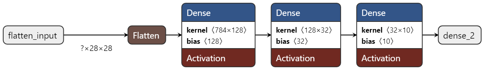

# Neural Network for MNIST Digit Recognition: Multi-Class Classification of Handwritten Digits

## Overview
This project involves training a neural network model to classify handwritten digits from the MNIST dataset using TensorFlow and Keras.

## Model Architecture
The model's architecture is as follows:




1. **Input Layer**: 
   - Flattens the input image dimensions of 28x28 pixels to a 1D array.

2. **First Dense Layer**: 
   - **Units**: 128
   - **Activation**: ReLU
   - **Kernel Size**: 784x128
   - **Bias Size**: 128

3. **Second Dense Layer**:
   - **Units**: 32
   - **Activation**: ReLU
   - **Kernel Size**: 128x32
   - **Bias Size**: 32

4. **Output Dense Layer**:
   - **Units**: 10 (one for each digit)
   - **Activation**: Softmax
   - **Kernel Size**: 32x10
   - **Bias Size**: 10

## Dependencies
- Python 3.8 or higher
- TensorFlow 2.x
- NumPy
- Matplotlib (for plotting training results)

## Installation
To set up the project environment:
```bash
pip install tensorflow numpy matplotlib
